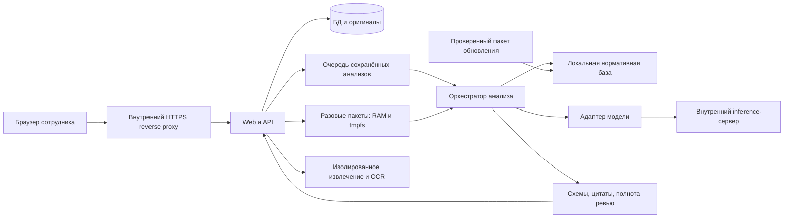
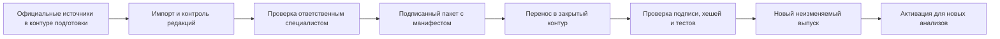

# Локальная установка «Договоры и риски» с моделями внутри организации

> **Статус:** проект целевой архитектуры; локальный исполнитель, OCR и корпоративное развёртывание ещё не реализованы этим документом.
> **Дата:** 2026-09-05. **Базовый срез:** пилот 0.1.8, commit `0521514`, до параллельных изменений интерфейса и нормативной базы.
> **Module:** web, analysis, extraction, normative corpus, operations. **Route:** `/docs/`. **Branch:** `codex/initial-app`.
> **Решение:** сохранить продукт и проверку доказательств на сервере, заменить транспорт модели адаптером внутреннего inference-сервера; сеть организации становится границей обработки документов.

## 1. Границы продукта и обязательные свойства

| Требование | Архитектурное следствие |
|---|---|
| Веб-интерфейс; простой логин и пароль пользователя | Браузер обращается только к приложению; настройка модели общая для установки и не требует отдельного входа пользователя |
| PDF, DOC, DOCX; пакетная загрузка и дедубликация | Сохранять оригинал и хеш; извлекать текст изолированно; отличать точный дубликат от похожего текста |
| Заказчики, договоры, шаблоны, редакции | Неизменяемые комплекты, явная связь с родителем; новая редакция не изменяет старые результаты |
| Паспорт: предмет, результат, сроки, цена, оплата, место, приёмка, зависимости, специальные условия | Каждое извлечённое значение с источником; отсутствующее или неоднозначное условие явно помечено |
| Два этапа с разными инструкциями | Аналитик и ревьюер — отдельные запросы; решение по каждому замечанию первичного анализа обязательно |
| Сохранять существующие пункты и разделы | Единица источника — исходный пункт, раздел, абзац или ячейка; технический ID не показывать как номер договора |
| Рекомендации и риски со ссылками | Цитата проверяется сервером; сохранённый риск связан с конкретной редакцией и снимком источника |
| Отслеживать снижение риска и наступление | Меры, сроки, ответственный, основание изменения статуса и подтверждённые события хранятся отдельно от вывода модели |
| Разовая проверка без хранилища | Отдельный временный контур: нет оригинала, текста, результата или задания в постоянном каталоге и резервных копиях |
| Локальные модели и нормативная база | Запрет внешней передачи, локальные веса/токенизаторы/индексы; обновления вносятся отдельным процессом |

Встроенных компаний нет: пользователь создаёт личную карточку организации вручную или принимает черновик LLM по ИНН. Сведения пользователя и найденные LLM источники не считаются автоматически подтверждёнными реестром. Место регистрации подрядчика не подменяет место выполнения работ; проверка учитывает выезды, площадки, удалённый формат, доступы, расходы и привлечение третьих лиц.

## 2. AS-IS: что есть в базовом коде 0.1.8

| Область | Реализация и ограничение |
|---|---|
| Веб/API | Node.js `http`, статические HTML/CSS/JS; маршруты и композиция зависимостей в `server/main.mjs`; отдельного frontend-сервера нет |
| Данные | `node:sqlite`, SQLite WAL, локальные файлы; таблицы пользователей, заказчиков, договоров, редакций, анализов, рекомендаций, рисков, источников, событий и аудита в `server/db.mjs` |
| Права | Владение данными через `user_id`, серверные сессии, scrypt; это изоляция аккаунтов, а не общее пространство подразделения с ролями |
| Модель | `CodexRunner` в `server/codex.mjs`, два `codex exec`, общая авторизация приложения; инструменты отключены; локального HTTP-исполнителя нет |
| Очередь | Один исполнитель в процессе приложения; постоянные задания выбираются из SQLite, разовые — из памяти; выбор по времени постановки; активные задания после перезапуска помечаются прерванными |
| Ревью | Ревьюер выдаёт `confirmed/corrected/rejected` для каждого замечания и новые замечания; сервер собирает результат, затем проверяет схему и цитаты. Полное перепечатывание всех подтверждённых замечаний не требуется |
| Правки | Формулировка для одного пункта по запросу; при занятом исполнителе запрос отклоняется. Сводка менеджеру собирается кодом без модели |
| Доказательства | AJV, полнота паспорта/покрытия правил, допустимые ID правил и уникальность замечаний; цитаты ищутся в точном снимке текста после нормализации пробелов |
| Извлечение | PDF: `pdftotext`; DOC: `antiword`; DOCX: OOXML и восстановление нумерации; `structure-v3`. Вызов через bubblewrap без сети, timeout и ограничение вывода. OCR отсутствует |
| Лимиты | 20 МБ на файл; разовая проверка до 20 файлов и 100 МБ; снимок текста до 360 000 символов; это ограничение приложения, не гарантия попадания в контекст любой модели |
| Разовая проверка | `QuickChecks` без зависимости от БД: объекты в памяти, исходники во временной директории только на время извлечения; TTL по умолчанию 1 час; один пакет на пользователя; до 12 временных пакетов |
| Нормативная база | В базовом срезе проверенная база не подключена; сервер добавляет ограничение правовой проверки. Подключаемая параллельно начальная база требует отдельной оценки покрытия и актуальности |
| Наблюдаемость | Длительность этапов, символы prompt, usage при наличии; не все версии параметров модели закреплены в снимке |
| Эксплуатация | Служба Linux, отдельный системный пользователь, reverse proxy, постоянный каталог и runtime; автоматическая корпоративная политика backup/retention в базовом коде отсутствует |

Проверенные исходники: [API](../server/main.mjs), [исполнитель](../server/codex.mjs), [схемы](../server/schema.mjs), [разовый режим](../server/quick-checks.mjs), [извлечение](../server/documents.mjs), [структура документа](../server/extract.py), [источники](../server/sources.mjs), [данные](../server/db.mjs).

**Дополнение к выпуску 0.2.0:** параллельно подключён начальный корпус из шести норм ГК РФ, часть 2 (ст. 702, 706, 708, 709), с хешами текста, метаданными и неизменяемой копией `snapshot.legal`; замечания получают проверяемые `legalSources`. Корпус имеет статус `reference_only`, `currentAsOf=null`: текущая редакция по официальному источнику не подтверждена, полная правовая проверка не заявляется. Это начальная справочная интеграция; подписанный offline-import, подтверждённая актуальность и полнота корпуса остаются TO-BE. Точное состояние и ограничения: [Нормативная база](<(sep-26)-normative-base.md>).

### 2.1. Обновление 0.3.0: организации и отдельный интернет-поиск

- Таблица organizations содержит user_id, реквизиты, JSON карточки, версию и даты. Пустой аккаунт не получает никаких готовых подрядчиков; ИНН уникален внутри аккаунта. При конкурентной правке старая версия отклоняется.
- POST/GET /docs/api/organizations и GET/PATCH /docs/api/organizations/:id обслуживают карточки. POST /docs/api/organizations/lookup запускает поиск, GET /docs/api/organizations/lookup/:id возвращает статус и черновик, POST по тому же адресу отменяет поиск. Все маршруты требуют авторизации, изменение — CSRF-подтверждения.
- Поиск проходит через общий Codex с web_search=live, без shell, браузера, плагинов и локальных инструментов; ввод — только валидный публичный ИНН. Задание и черновик находятся в памяти на 15 минут, после перезапуска пропадают. Ограничения: 3 минуты на запрос и 6 запусков в час на пользователя, общий исполнитель; очередь анализа не вытесняется.
- Ответ проходит JSON Schema, сверку ИНН, проверку HTTPS-ссылок и наличия события web_search. Это структурная проверка, не независимая сверка текста реестра. Каждый источник имеет статус unverified; дата поиска не равна дате актуальности. Сохранение — только явное действие пользователя; источники LLM могут перестать соответствовать полям после ручной правки, интерфейс это сообщает.
- Постоянный анализ замораживает карточку на запуске, разовый пакет — при создании. Старые снимки, документы и риски не переписываются. Старым договорам пользователь выбирает новую организацию; предположение о Москве удалено из LOC-01 (версия 4).
- Для целевого air-gap-контура интернет-поиск выключается; остаются ручной ввод и отдельно контролируемый импорт публичного справочника. Даже после подключения локального inference веб-поиск требует отдельного транспорта и политики egress, не является частью анализа договоров.

## 3. TO-BE: компоненты и размещение



Весь граф — внутри организации. Пакеты обновлений проходят контролируемый импорт; в штатном анализе внешних соединений нет. Временный контур передаёт содержимое оркестратору в памяти и не использует постоянную очередь. Стрелка от него не означает сохранения текста в брокере.

### 3.1. Минимальная установка

- Один Linux-хост: reverse proxy, приложение, SQLite, локальный каталог оригиналов, worker извлечения, локальный inference runtime.
- Разделение системными пользователями и контейнерами/песочницами; runtime модели не получает каталоги договоров, БД или секреты веб-приложения.
- Один активный модельный запрос; два этапа одного договора последовательны. Несколько сотрудников могут читать и загружать документы независимо от GPU-очереди.
- SQLite допустим при одном узле записи; база на локальном диске. Нельзя масштабировать такую установку простым запуском нескольких текущих `CodexRunner`: его блокировка `busy` локальна процессу.
- Начать с systemd или Compose с закреплёнными образами; Kubernetes не является условием локальной установки.

### 3.2. Установка для подразделения

- Web/API и workers вынесены из GPU-узла; PostgreSQL для общей БД, внутреннее объектное хранилище оригиналов с versioning; нормативный индекс локальный.
- Постоянная очередь с lease/heartbeat и атомарным захватом задания; можно начать с таблицы PostgreSQL, не вводя отдельный брокер до появления измеренной потребности.
- GPU-пул с ограничением одновременных запросов по токенам и памяти; рабочие очереди не равны числу пользователей.
- Разовые пакеты обслуживает отдельный процесс с RAM/tmpfs. При потере процесса результат теряется, интерфейс просит повторную загрузку; восстановление из постоянного журнала не заявляется.
- Два экземпляра API не дают отказоустойчивости сами по себе: нужны общие сессии/права, согласованный доступ к файлам, защита от повторного запуска, мониторинг и проверенное восстановление.

## 4. Исполнитель локальной модели

### 4.1. Граница адаптера

Сначала отделить постановку заданий и сохранение результата от существующего `CodexRunner`. Предлагаемые модули: `analysis-orchestrator`, `providers/codex`, `providers/local-chat`, `model-config`. Это новые точки расширения, не существующие файлы базового среза.

```typescript
interface ModelProvider {
  health(): Promise<{ ready: boolean; modelRevision: string; capabilities: string[] }>;
  countTokens(input: ModelInput): Promise<number>;
  generate(input: {
    runId: string; attemptId: string;
    stage: 'primary' | 'review' | 'proposal';
    instructions: string; data: unknown; jsonSchema: object;
    model: string; maxOutputTokens: number; timeoutMs: number;
    signal: AbortSignal; temporary: boolean;
  }): Promise<{
    json: unknown; finishReason: string;
    usage: { inputTokens: number; outputTokens: number } | null;
    durationMs: number; modelRevision: string;
  }>;
}
```

`countTokens` использует именно токенизатор и chat template выбранной модели. При несовпадении ревизии токенизатора запуск отклоняется. Оркестратор формирует данные и инструкции; адаптер отвечает за HTTP/CLI, формат протокола, завершение и отмену. Валидатор доменных фактов остаётся общим.

### 4.2. Внутренний OpenAI-совместимый endpoint

Под «OpenAI-совместимым» понимается формат HTTP-запроса к серверу организации, например `https://inference.internal/v1/chat/completions`. Он не означает внешний OpenAI API, покупку API-ключа или перенос пользовательской авторизации Codex. Базовый облачный вариант сохраняет общий Codex; локальный вариант использует служебный доступ приложения к локальному runtime, общий для установки.

Кандидаты runtime для испытаний:

| Runtime | Роль в проекте | Что проверить на закреплённой версии |
|---|---|---|
| vLLM | Кандидат для GPU-сервера подразделения | Совместимость конкретной архитектуры/квантизации/драйвера, лимиты контекста и одновременных запросов, JSON Schema и отмена |
| llama.cpp / llama-server | Кандидат для компактной установки и GGUF | Размещение слоёв CPU/GPU, приемлемое время на длинном русском документе, поддержка используемой схемы и chat template |

vLLM предоставляет HTTP-сервер с совместимыми chat/completions маршрутами; наличие совместимого протокола не означает одинаковую поддержку всех параметров. [Официальная документация vLLM](https://github.com/vllm-project/vllm/blob/main/docs/serving/online_serving/openai_compatible_server.md).

vLLM поддерживает ограничение вывода JSON-схемой; параметры и поддержка reasoning-режимов зависят от версии и backend. Адаптер должен проверять возможности при старте и иметь отдельные protocol-тесты. [Structured outputs vLLM](https://docs.vllm.ai/en/latest/features/structured_outputs/).

llama-server заявляет CPU/GPU inference, квантованные модели, совместимые HTTP-маршруты и schema-constrained JSON. Это основание включить его в испытания, но не доказательство достаточной точности или скорости на договорах. [Официальный llama-server README](https://github.com/ggml-org/llama.cpp/blob/master/tools/server/README.md).

Конфигурация доступна администратору установки: provider, фиксированные model ID/ревизии, endpoint из allowlist, токенизатор, template, schema dialect, максимальный контекст, лимиты этапов. Пользователь видит понятные режимы проверки. URL от пользователя, переходы по HTTP redirect и автоматический fallback во внешнее облако запрещены.

### 4.3. Два этапа, доказательства и ошибки

1. Сервер фиксирует снимок документов, профиля, правил, нормативного корпуса, дат применимости и конфигурации модели.
2. Аналитик получает полный допустимый комплект; возвращает паспорт, замечания, покрытие правил и ограничения.
3. Сервер проверяет JSON Schema, ID, цитаты, полноту и допустимость нормативных ссылок. Невалидный результат не становится готовым анализом.
4. Ревьюер получает тот же исходный комплект и нормативный снимок, первичный результат как недоверенные данные и отдельные инструкции проверки. Он проверяет также пропуски аналитика.
5. Ревьюер возвращает одно решение на каждое исходное замечание, исправления/добавления, уточнённый паспорт и покрытие. Сервер детерминированно собирает и повторно валидирует результат.
6. Принятие правки, регистрация риска и подтверждение наступления выполняются действием сотрудника; модель не получает методов изменения БД.

Одна модель на двух этапах допустима для минимального варианта; разные инструкции не делают ошибки статистически независимыми. Вторую модель выбирать только по результатам сравнения: сколько ошибок первичного анализа она исправляет и сколько добавляет. Возврат `finish_reason=length`, обрыв потока, неизвестная модель или неполное ревью — ошибка этапа, а не частичный успех.

Предлагаемая политика повторов: максимум два транспортных повтора при временных 429/503/сетевом сбое с backoff и jitter; максимум один запрос исправления невалидной структуры с конкретным списком ошибок. Общий deadline ограничивает все попытки. Неподтверждённая цитата требует нового валидного ответа, сервер не подставляет похожую цитату. Все попытки имеют ID; постоянный анализ хранит их метаданные, разовый — только до своего TTL.

При сбое ревью первичный результат сохраняется со статусом «без завершённого ревью». Повтор ревью допустим только с тем же первичным снимком; замена правил/модели/источников создаёт новую попытку с явно зафиксированной конфигурацией. После отмены проверять lease/token перед записью результата, чтобы поздний ответ модели не оживил отменённое задание.

### 4.4. Длинные документы без технической нарезки

- До запуска считать `T_total = T_instructions + T_documents + T_norms + T_primary_for_review + T_output_reserve + T_safety` для обоих этапов; брать худший этап.
- Не переводить 360 000 символов в фиксированное число токенов: русский текст, таблицы и нумерация дают разные соотношения.
- Основной путь — полный комплект в контексте. Если он не помещается, показать конкретную причину и доступный предел; не обрезать молча и не возвращать полное покрытие.
- Расширенный режим для длинных комплектов — отдельная будущая функция: обработка целых существующих разделов и приложений с общей картой обязательств, зависимостей и перекрёстных ссылок; затем обзор всего комплекта. Она требует собственного тестового набора полноты.
- Если один исходный пункт превышает контекст, не выдумывать подпункты. Ссылка остаётся на исходный пункт; до поддержки безопасного режима анализ ограничивается явно.
- Поиск только нескольких «похожих» пунктов не считается проверкой отсутствующих условий во всём договоре.

## 5. Документы, хранение, редакции и риски

### 5.1. Неизменяемые данные

| Сущность | Содержание и инвариант |
|---|---|
| `FileBlob` | Байты оригинала, MIME/формат, SHA-256, размер; повторная загрузка не перезаписывает байты |
| `ExtractionVersion` | Версия extractor, полный текст, предупреждения, структурные источники, хеш результата; обновление создаёт новую версию |
| `SourceLocator` | Файл/хеш, редакция, буквальный номер/заголовок, приложение, страница или таблица/ячейка, внутренний ID; одинаковый «п. 1» в двух приложениях не смешивается |
| `Revision` | Неизменяемый список файлов/версий извлечения, родитель и примечание; действующая редакция — отдельный явный указатель |
| `AnalysisSnapshot` | Все входные версии, выбранные нормы и дата проверки; воспроизводимость входа без обещания побитово одинакового вывода GPU |
| `Finding` | Правило/версия, описание, критичность, ссылки на договор, отдельные ссылки на норму, решения ревьюера и сотрудника |
| `Risk` / `RiskSource` | Постоянный риск и замороженное основание; новая редакция может предложить сопоставление, но не заменяет источник автоматически |
| `RiskEvent` | Мера, ответственный, срок, выполнение и основание; сигнал и подтверждённое наступление различаются |

Точный дубликат определяется по байтам и хешу внутри области доступа. Похожий нормализованный текст — подсказка пользователю, а не автоматическое объединение договоров или редакций. Глобальная дедубликация не должна раскрывать наличие чужого файла через ответ API или время обработки; для первого этапа оставить дедубликацию в пределах договора/временного пакета.

### 5.2. Извлечение и OCR

- Сначала проверять расширение, сигнатуру, лимиты размера, количества архивных элементов и распакованного объёма DOCX; отклонять zip bomb и повреждённые входы.
- DOCX: разбирать OOXML и numbering.xml; сохранять стили нумерации, перезапуски, таблицы и границы приложений. Поля Word, tracked changes и неоднозначные списки отмечать, а не реконструировать догадкой модели.
- DOC: antiword как базовый путь; LibreOffice headless — возможный дополнительный конвертер в изолированной одноразовой среде, без макросов, ссылок на внешние ресурсы и доступа к домашним каталогам.
- PDF: текстовый слой и страницы. Для сканов добавить локальный OCR с русскими языковыми ресурсами; хранить OCR как производный слой, не изменять исходный подписанный файл.
- OCR-confidence использовать как технический сигнал, не как вероятность юридической правильности. Сомнительные цифры/номера/суммы выделять и давать оригинальную страницу для проверки.
- Каждый worker без сети, от непривилегированного пользователя, с read-only root и одним входом, tmpfs, cgroups CPU/RAM/PIDs, seccomp/AppArmor по платформе, deadline; журнал не содержит текста договора.

OCR не является средством обезвреживания PDF: авторы OCRmyPDF отдельно рекомендуют изоляцию недоверенных файлов. [Официальные рекомендации по безопасности PDF](https://ocrmypdf.readthedocs.io/en/v15.3.1/pdfsecurity.html). Конкретную версию OCR-инструментов закрепить и проверить при сборке; ссылка описывает принцип безопасности, не рекомендуемую старую версию для установки.

### 5.3. Временный режим без постоянного хранения

Сохранить существующую семантику TTL 1 час как начальное значение, вынести в настройку установки. Контент только в памяти и tmpfs; постоянная БД не содержит ни задания, ни хеша/имени файла, ни результатов. Допустим обезличенный счётчик нагрузки без идентификаторов документа.

Для выполнения обещания по всему контуру нужны: отключённый prompt/response logging у proxy и модели; отсутствие disk prefix/KV cache и дампов слотов; отключённые core dumps; исключение runtime из backup; swap отключён либо защищён согласно принятой политике. Кэш между пользователями для временных запросов не использовать. Память GPU/RAM освобождается при завершении, однако приложение не обещает физического криптографического стирания всех копий памяти. Если требуется такая гарантия изоляции, нужен выделенный worker/runtime с завершением процесса и отдельная аттестация среды.

Удаление/TTL/перезапуск отменяют активный запрос, ждут освобождения worker и убирают временные файлы. Браузер не сохраняет содержимое в localStorage/IndexedDB/service worker. Скачанный сотрудником отчёт находится вне временного контура; перед скачиванием это ясно обозначено. Разовые пакеты не используются для обучения или набора оценочных примеров автоматически.

## 6. Локальная нормативная база

### 6.1. Модель доверия

Нормативная база — версионируемый набор доказательств и правил применимости, а не свободный чат с PDF. Начальное подключение отдельных норм не даёт покрытия всего законодательства. Коммерческий риск, внутренний стандарт компании и ссылка на обязательную норму имеют разные типы основания.

Предлагаемые поля нормативного пакета:

| Поля | Назначение |
|---|---|
| `corpusId`, `releaseId`, `createdAt`, `manifestHash`, `signature` | Идентичность импортированного выпуска; проверка целостности и издателя внутреннего пакета |
| `actId`, `title`, `issuer`, `number`, `adoptedAt`, `officialUrl` | Идентификация акта и исходного официального опубликования |
| `editionId`, `validFrom`, `validTo`, `checkedAt`, `checkedBy` | Редакция и подтверждённый период действия; дата проверки не подменяет дату вступления в силу |
| `article`, `part`, `item`, `text`, `textHash`, `sourceArtifactHash` | Точная норма, её текст и происхождение |
| `scope`, `applicability`, `exceptions`, `relatedRules` | Типы договоров, территория, условия применимости, исключения и связанные критерии |
| `status`, `coverageNotes`, `reviewDueAt` | `draft/approved/withdrawn`, ограничения покрытия и срок следующей проверки |

Официальный URL сохраняется для происхождения; при анализе сервер его не открывает. Для air-gap интерфейс показывает импортированный источник и дату его проверки. Права на импорт, хранение и переиспользование материалов из коммерческих систем проверяются отдельно; такие материалы не включаются в пакет автоматически.

### 6.2. Поиск и применение

1. Зафиксировать дату, на которую проводится проверка, предполагаемые даты подписания/исполнения и известные факты сделки; неизвестные факты оставить неизвестными.
2. Отобрать только одобренные нормы подходящей редакции и сферы. При неустановленной применимости выдавать вопрос/ограничение, а не вывод о нарушении.
3. На старте использовать явную привязку правил к статьям плюс локальный полнотекстовый поиск. Векторный поиск и reranker добавлять после измерения полноты; они не являются обязательным компонентом пилота.
4. Передавать модели выбранные нормы с точными ID, текстом, датами и исключениями. Договор и нормативный текст отделены от управляющей инструкции и остаются недоверенными данными.
5. Валидировать `legalSources`: ID входит в выбранный снимок, цитата найдена в норме, версия допустима на выбранную дату; отдельно валидировать `contractSources`. Дословная цитата подтверждает происхождение, но не логическую применимость — это задача ревью и сотрудника.
6. Сохранить нормативный снимок вместе с постоянным анализом и основанием риска. Обновление корпуса создаёт предложение повторной проверки затронутых договоров; прошлые результаты не переписываются.

### 6.3. Обновление в закрытом контуре



Минимальный регламент: назначенный владелец корпуса, фиксированный график проверки и внеплановая загрузка существенных изменений; целевой интервал определяется организацией. Если выпуск просрочен или нужной редакции нет, интерфейс показывает дату и границы покрытия. Кнопка запуска не должна изображать полностью актуальную нормативную проверку. Старый выпуск доступен для воспроизведения истории; откат активного выпуска не удаляет новые данные.

## 7. Очереди, API и наблюдаемость

Существующие бизнес-маршруты `/docs/api/` сохранить. Новый внутренний endpoint модели не публикуется в браузер. Возможные новые административные API — `/settings/inference`, `/normative/releases`, `/normative/imports`; это проект интерфейсов, не утверждение о наличии маршрутов.

Состояния постоянного анализа: `queued → primary → review → complete`; ошибки различают `failed_primary`, `failed_review`, `interrupted`, `cancelled`, `context_exceeded`. UI может отображать их простыми русскими подписями. Каждый этап имеет `attemptId`, номер попытки, начало/конец, lease и код причины; завершение атомарно относительно проверки отмены.

- Один лимит на реальные GPU-запросы, отдельный лимит на извлечение и OCR; справедливость по пользователям/подразделениям, чтобы большой пакет не блокировал очередь бесконечно.
- Короткие формулировки по запросу имеют ограниченную квоту; выбранная политика приоритета не должна голодать полные анализы. До отдельного планировщика можно сохранить текущий явный отказ при занятом исполнителе.
- Метрики: ожидание, prefill/время до первого токена, генерация, общее время этапа, число входных/выходных токенов, длина контекста, retries, schema/grounding errors, GPU/RAM, доля завершённых ревью.
- В журнале: ID задания/этапа, версии, размеры и коды ошибок. Текст договора, цитаты, пароли и служебные токены по умолчанию не логируются; debugging с содержимым — отдельный отключённый режим для искусственных примеров.
- Прогресс показывает очередь и этап; процент «готовности» и обещанное время не выдумываются. ETA можно включить после измерений по диапазонам длины и нагрузке.
- Автоматический circuit breaker при повторяющихся OOM/ошибках модели останавливает приём новых запусков, сохраняя доступ к существующим данным.

## 8. Доступ, закрытая сеть и эксплуатация

### 8.1. Авторизация и общая работа

Базовый способ входа остаётся логин/пароль с серверной сессией; настройка модели на уровне приложения. Для первой установки достаточно закрыть самостоятельную регистрацию после создания разрешённых пользователей или ограничить её корпоративной сетью и списком приглашений. Не добавлять обязательный SSO без потребности организации.

Совместная работа потребует отдельной миграции: `organization`, `membership`, `contract_acl`. Роли-кандидаты: администратор установки, ответственный за нормативную базу, редактор договоров, наблюдатель. Назначение «ответственный по риску» не выдаёт автоматически доступ ко всем договорам. Технический администратор не получает роль согласующего юридические выводы только по своему системному доступу. SSO/OIDC и MFA — опциональная интеграция, а не условие обычного входа.

### 8.2. Запрет внешних соединений

- Default-deny egress на уровне хоста/сегмента для web, workers, OCR, inference, индексов; allowlist только внутренних БД, хранилища, PKI/DNS/NTP и мониторинга.
- Службы моделей слушают loopback или выделенный внутренний адрес; для межузлового трафика TLS/mTLS и служебная аутентификация. Браузеру endpoint и ключ не выдаются.
- Веса, tokenizer, chat template, OCR языки, зависимости и контейнеры заранее доставлены в внутренний registry; запуск не скачивает недостающие файлы.
- Для vLLM отключить usage statistics через `VLLM_NO_USAGE_STATS=1` или `DO_NOT_TRACK=1`. [Официальные настройки vLLM](https://docs.vllm.ai/en/latest/usage/usage_stats/).
- Для компонентов Hugging Face использовать локальные пути и `HF_HUB_OFFLINE=1`; при отсутствии локального файла операция должна завершиться ошибкой. Отключение телеметрии настраивается отдельно через `HF_HUB_DISABLE_TELEMETRY=1`. [Официальные переменные Hugging Face Hub](https://huggingface.co/docs/huggingface_hub/en/package_reference/environment_variables).
- Эти флаги дополняют firewall, а не заменяют его. Приёмка включает запуск с заблокированными интернетом и внешним DNS, наблюдение попыток соединений и отсутствие внешних ресурсов страницы.

### 8.3. Сборка, обновления, секреты

Поставка: подписанные образы/архивы с digest, SBOM, версии OS/runtime/драйверов/моделей/токенизаторов и лицензии, миграции, synthetic smoke fixtures и инструкция отката. Веса не загружать как произвольный исполняемый код; `trust_remote_code` не включать без отдельного review конкретного пакета. Секреты хранятся в локальном защищённом хранилище или файлах службы с минимальными правами, не в Git и не в bundle браузера.

Обновление: согласованный backup → новый release → миграции на копии/проверка совместимости → smoke → переключение трафика → наблюдение. При изменении схемы БД откат бинарника разрешён только если подтверждена обратная совместимость; иначе восстанавливается согласованный комплект БД и файлов. Миграция в PostgreSQL требует отдельного сверочного отчёта по количествам, ссылкам, хешам и правам, а не только успешного запуска приложения.

### 8.4. Backup, retention и аудит

| Объект | Предлагаемая политика для согласования |
|---|---|
| Постоянные договоры/редакции/анализы | Срок устанавливает организация по категориям документов; автоматическое удаление выключено до утверждения. Возможны legal hold и запрет удаления связанного основания риска |
| Резервные копии | Шифрованные, в отдельном внутреннем контуре; ключи отдельно; SQLite backup API или согласованный snapshot, в командной версии PostgreSQL backup/PITR и согласованное хранилище файлов |
| Цели восстановления | Начальное предложение для пилота: RPO 24 ч, RTO 4 ч; это цели, которые нужно подтвердить тренировкой восстановления, не текущие гарантии |
| Разовые проверки | TTL 1 ч; нет backup/постоянного задания/контентных журналов; потеря при перезапуске ожидаема |
| Нормативные выпуски | Сохранять все версии, на которые есть анализы; индекс можно перестроить из неизменяемого корпуса |
| Модели | Сохранять как минимум активный и предыдущий проверенный пакет и их лицензии; хранение иных версий определяется потребностью воспроизведения |
| Аудит | Кто/когда/что/над какой сущностью/результат; смена прав, активной нормативной версии и модели обязательна. Append-only для приложения; внешнее внутреннее хранилище аудита при требовании защиты от администратора БД |

Проверять восстановление на отдельной среде не реже выбранного эксплуатационного интервала; предложенный старт — ежемесячно и после изменений backup. Удаление из активной БД не означает удаления из backup: сроки и процедура восстановления должны учитывать отложенное истечение резервных копий. Запрет постоянного хранения разовых пакетов действует с начала обработки и не решается последующим удалением из общей БД.

## 9. Модели, оборудование и измерение качества

### 9.1. Требования к аппаратному обеспечению

**Рекомендация для основного пилота: Linux-сервер, 12–16 физических CPU-ядер, 128 ГБ RAM, одна GPU с 48 ГБ VRAM, два NVMe по 2 ТБ в зеркале и отдельная резервная копия.** Начать с одной модели 27B в проверенной 4–6-битной квантизации и одного активного запроса. Это наша инженерная конфигурация для испытаний, а не подтверждённая производительность или готовая спецификация закупки.

Таблица разделяет действующее приложение и будущий локальный inference. Количество сотрудников означает одновременную работу с интерфейсом, не столько же одновременных генераций. Значения контекста — стартовые лимиты стенда вместе с входом и выходом, не разрешение обрезать договор.

| Сценарий | CPU и RAM | Хранилище | GPU и модельный режим | Начальная нагрузка |
|---|---|---|---|---|
| Текущий сервер с внешним Codex, без локальной модели | 2–4 vCPU, минимум 4 ГБ RAM, рекомендовано 8 ГБ | SSD от 100 ГБ свободного места плюс рассчитанный объём документов/backup | GPU не нужна; текст анализа выходит во внешний сервис | Один активный анализ; предел пользователей проверить нагрузочным тестом |
| Экономный локальный пилот | 8 физических ядер, 64 ГБ RAM | NVMe 1 ТБ; backup отдельно | 1 × 24 ГБ VRAM; Qwen3.5-9B, Q4–Q8 | 1–5 сотрудников; 1 запрос; контекст 16–32 тыс. токенов |
| Основной локальный пилот — рекомендуемый | 12–16 физических ядер, 128 ГБ RAM; ECC желательно | 2 × 2 ТБ NVMe, RAID1: около 2 ТБ номинально полезной ёмкости; отдельный backup | 1 × 48 ГБ VRAM; модель 24–27B, Q4–Q6 | 5–15 сотрудников; 1 запрос; начать с 32–64 тыс. токенов |
| Подразделение, после доработки очереди | Web/БД: 8 vCPU, 32 ГБ RAM; inference: 24 физических ядра, 256 ГБ RAM | GPU-узел: NVMe 2 ТБ для весов; данные: 2 × 3,84 ТБ в зеркале; backup отдельно | 1 × 96 ГБ для запаса памяти или 2 × 48 ГБ как два отдельных исполнителя | 10–30 сотрудников; начать с 2 запросов; 64–128 тыс. токенов только после замеров |
| CPU-only: функциональная лаборатория | 12–16 физических ядер, 64–128 ГБ RAM | NVMe 1 ТБ | Без GPU; модель 9B Q4 с llama.cpp | 1 запрос; начать с 8–16 тыс. токенов; интерактивный SLA не заявляется |

У текущего сервиса **одна очередь и один исполнитель**. Дополнительная GPU не включает параллельный анализ автоматически. Два этапа одного договора выполняются последовательно, поэтому им не обязательно нужны две GPU. Для одновременного размещения двух разных моделей нужно учесть сумму их памяти; выгрузка/загрузка весов между этапами добавит задержку.

Примеры классов оборудования, не обязательные поставщики:

- Для рабочего места/пилота: NVIDIA RTX 6000 Ada — 48 ГБ GDDR6 ECC, до 300 Вт, активное охлаждение. Это характеристики производителя, не замер нашего приложения. [Спецификация NVIDIA](https://www.nvidia.com/en-us/products/workstations/rtx-6000/).
- Для серверного запаса памяти: NVIDIA RTX PRO 6000 Blackwell Server Edition — 96 ГБ. Подбирать совместимое серверное шасси, питание и охлаждение по спецификации именно Server Edition. [Спецификация NVIDIA](https://www.nvidia.com/en-us/data-center/rtx-pro-6000-blackwell-server-edition/).
- Имеющуюся GPU 24/32 ГБ можно использовать для стенда с меньшей моделью. Не покупать несколько карт только ради суммы VRAM: две карты 24 ГБ не эквивалентны одной 48 ГБ без совместимого распределения модели, интерконнекта и измерения задержек.

Дополнительные требования к размещению:

1. Физические PCIe-линии, свободные слоты, габариты и воздушный поток должны соответствовать GPU; пассивную серверную карту нельзя ставить в неподготовленный офисный корпус.
2. Мощность БП и ИБП считать по пиковой нагрузке всего узла с запасом, а не только TDP видеокарты. Нужны охлаждение помещения, мониторинг температуры и сценарий штатного завершения при потере питания; резервные БП — для требуемой доступности.
3. Сеть 1 Гбит/с достаточна как старт пилота для текстовых запросов; 10 Гбит/с целесообразно между узлами и backup при больших оригиналах/выпусках моделей. Это ориентир, подтверждаемый объёмами.
4. RAM, VRAM и место на диске не взаимозаменяемы. CPU-offload может позволить загрузить модель, но не гарантирует приемлемой скорости.
5. Для Linux/GPU закрепить совместимую матрицу GPU → драйвер → CUDA/runtime → формат квантизации. Windows/WSL и Apple unified memory не считать эквивалентной серверной поставкой: текущая песочница и systemd ориентированы на Linux.
6. Оригиналы, снимки анализов, нормативные выпуски, две версии моделей и backup считать отдельно. Например, 10 000 уникальных файлов по 10 МБ — около 100 ГБ только оригиналов; модели и копии в это число не входят. Оставлять 25–30% свободного диска — наша эксплуатационная рекомендация. RAID не заменяет backup; RPO/RTO подтверждаются восстановлением.

### 9.2. Какие локальные модели использовать

Проверка карточек производителей: **5 сентября 2026**. Ни одна из моделей ниже пока не испытана в этом сервисе на русскоязычных договорах. Рекомендации — порядок пилотных испытаний, не рейтинг юридической точности. Использовать post-trained/instruct-вариант из указанного репозитория, не Base, не произвольную community-модификацию.

| Приоритет и роль | Точный model ID | Почему включён в испытания | Память и ограничения |
|---|---|---|---|
| Основной старт: оба этапа | Qwen/Qwen3.5-27B | Общие инструкции и длинный контекст; разумный базовый кандидат для сравнительной проверки договоров. Заявлены 27B и родной контекст 262 144; карточка содержит общие, не юридические тесты | Стенд 48 ГБ VRAM с проверенной Q4–Q6. Не означает, что весь родной контекст поместится. [Карточка Qwen](https://huggingface.co/Qwen/Qwen3.5-27B) |
| Экономный пилот | Qwen/Qwen3.5-9B | Меньше весов, удобно для проверки процесса и коротких комплектов; 9B. Качество на сложных перекрёстных условиях нужно измерить | Стенд 24 ГБ VRAM, Q4–Q8. Не использовать как единственного арбитра высокого риска. [Карточка Qwen](https://huggingface.co/Qwen/Qwen3.5-9B) |
| Сравнить с основным кандидатом | Qwen/Qwen3.6-27B | Более новый 27B-выпуск; заявленные улучшения сосредоточены на coding/agentic-задачах, поэтому юридическое преимущество не предполагается автоматически | Тот же класс 48 ГБ с квантизацией; для длинного reasoning проверить больший запас VRAM. [Карточка Qwen](https://huggingface.co/Qwen/Qwen3.6-27B) |
| Проверить при приоритете пропускной способности | Qwen/Qwen3.6-35B-A3B | MoE: 35B всего, 3B активных; кандидат на сравнение задержек с dense 27B, не обещание ускорения | Планировать память всех 35B весов, не 3B. Начать со стенда 48 ГБ и Q4; качество и kernels проверить отдельно. [Карточка Qwen](https://huggingface.co/Qwen/Qwen3.6-35B-A3B) |
| Второе семейство для контрольного ревью | mistralai/Mistral-Small-3.2-24B-Instruct-2506 | Более ранний 24B instruct-выпуск; производитель отмечает улучшения следования инструкциям и снижение повторов. Нужен для проверки ценности ревью другой моделью, не как автоматически лучший ревьюер | 48 ГБ с проверенной квантизацией; полные BF16-веса почти исчерпывают такую карту. [Карточка Mistral](https://huggingface.co/mistralai/Mistral-Small-3.2-24B-Instruct-2506) |

В карточках перечисленных выпусков указана **Apache-2.0**. Перед переносом сохранить точные LICENSE/NOTICE, ревизию и хеши исходных весов; для сторонней квантизации проверить её происхождение и условия отдельно. Наличие лицензии не является гарантией качества или разрешением использовать любые обучающие/договорные данные.

Предлагаемая двухступенчатая конфигурация после реализации локального адаптера:

- Основной пилот: одна Qwen3.5-27B на обоих этапах, разные инструкции, одинаковый снимок договора и норм. Это дешевле по памяти, но ошибки могут коррелировать.
- Экономный вариант: Qwen3.5-9B на обоих этапах с ручной проверкой; переход на 27B при недостаточной полноте. Связка 9B → 27B допускается только после сравнения с 27B → 27B.
- Контрольная серия: Qwen3.5-27B → Mistral Small 3.2; сохранить её в продукте, только если ревью исправляет больше ошибок, чем добавляет. На одной GPU грузить модели последовательно либо подтвердить размещение обеих в памяти.
- Сначала сравнить режим без thinking и ограниченный thinking на одном наборе. Рассуждения могут увеличить время и потребление контекста; ревьюер получает итоговый структурированный результат, не скрытые рассуждения другой модели.

Qwen3.6 поддерживает переключение thinking; её карточка рекомендует сохранять контекст не менее 128K для reasoning-сценариев и указывает vLLM ≥0.19.0. Короткий пилотный лимит 32–64K — осознанное ограничение стенда, не воспроизведение рекомендуемого длинного reasoning-режима. [Требования Qwen3.6](https://huggingface.co/Qwen/Qwen3.6-27B).

Для серверного пилота — **vLLM** с закреплённой совместимой версией и JSON Schema; для компактного GGUF/CPU-offload стенда — **llama.cpp** с проверенной сборкой. Поддержка архитектуры модели, квантизации, reasoning parser и нужной схемы проверяется совместно. Валидный JSON не доказывает правильность цитаты или вывода: доменная проверка остаётся в приложении. [Structured outputs vLLM](https://docs.vllm.ai/en/latest/features/structured_outputs/), [llama-server](https://github.com/ggml-org/llama.cpp/blob/master/tools/server/README.md).

Не переносить в production указатели latest/main/nightly из демонстраций производителей: зафиксировать проверенный релиз/digest. Не включать агентные инструменты, внешний поиск, URL-загрузку картинок или автоматическое скачивание весов при анализе. В этой версии сервис передаёт текст; мультимодальность выбранных моделей сама по себе не добавляет OCR.

### 9.3. Как считать память и длину комплекта

Оценка ниже — арифметическая нижняя граница полезных весов, **не фактический размер файла или занятая VRAM**. GB здесь десятичные; 1 GiB = 2³⁰ байт. Квантованные веса содержат метаданные и часто неквантованные слои.

| Размер модели | 4 бита: минимум весов | 8 бит: минимум весов | BF16/FP16: минимум весов |
|---|---|---|---|
| 9B | 4,5 ГБ | 9 ГБ | 18 ГБ |
| 24B | 12 ГБ | 24 ГБ | 48 ГБ |
| 27B | 13,5 ГБ | 27 ГБ | 54 ГБ |
| 35B | 17,5 ГБ | 35 ГБ | 70 ГБ |

Формула: параметры × битность / 8. Сверху нужны KV cache/состояние linear attention, runtime buffers, активации, служебные/визуальные компоненты и резерв. Для обычного attention приблизительный KV: 2 × attention-слои × KV-heads × head-dim × байт элемента × токены × одновременно обслуживаемые последовательности. Гибридные Qwen используют также linear attention: нельзя применять формулу ко всем слоям как к обычному transformer. Квантизация KV и квантизация весов — разные настройки.

Именно поэтому 27B BF16 не помещается целиком в 48 ГБ, а «27B Q4 = 13,5 ГБ» не доказывает, что 24 ГБ достаточно для длинного ревью. Для BF16 27B планировать стенд класса 80/96 ГБ и всё равно измерять запас. Два экземпляра модели и два запроса с KV требуют отдельного расчёта.

Считать токенизатором выбранной ревизии: инструкции + весь пакет + нормы + первичный результат для ревью + лимит ответа + запас reasoning. Лимит приложения 360 000 символов не равен фиксированному количеству токенов. Ни число страниц, ни 262K в карточке не гарантируют размещения на выбранной GPU. Если комплект не помещается — явный отказ/предложение более ёмкого режима, а не обрезка или техническая нарезка пунктов.

До закупки выполнить матрицу 16K/32K/64K/128K по необходимости, по 1 и 2 одновременных запроса, оба этапа и длинный исходный пункт. Зафиксировать cold/warm старт, время очереди, P50/P95, peak VRAM/RAM, schema/цитаты, пропуски и ложные тревоги. Для разовых проверок отдельно подтвердить отсутствие контентных логов и дискового кэша.

### 9.4. Отбор модели на русском языке


- Выбирать минимум две совместимые instruct-модели разных размеров/семейств с разрешённой лицензией и закреплёнными ревизиями. Конкретный победитель в этом документе не назначен.
- Набор: договор услуг/подряда, ПО и права, NDA, техническое задание/SLA, персональные данные, лицензии/привлекаемые исполнители, выезды и площадки; приложения с повторяющейся нумерацией, таблицы, DOCX списки, сканы и плохой OCR.
- Включить контрпримеры: отсутствующее условие, «не применимо», допустимая договорённость, противоречие между приложением и договором, изменение редакции, норма вне даты действия, норма с исключением и инструкция-атака внутри документа.
- Нужна разметка профильного сотрудника и юриста для нормативной применимости; разделить development и закрытый контрольный набор. Synthetic fixtures проверяют механизм, но не заменяют документы, похожие на реальные.
- Измерять отдельно: точность/полноту по критичным рискам, ложные срабатывания, паспорт, ссылки и номера пунктов, применимость норм, пригодность правок, новые ошибки ревьюера, schema failure/retry, время P50/P95, peak VRAM, пропускную способность при очереди.
- Сравнивать одинаковые снимки входа и нормативной базы; менять один фактор за прогон. Для квантованной версии повторять оценку, а не переносить качество неквантованных весов.

Предлагаемые ворота приёмки для согласования: 100% сохранённых цитат проходят детерминированную проверку; 100% первичных замечаний имеют решение ревьюера; 0 утечек между пользователями; 0 незаявленных внешних соединений; на закрытом наборе целиться в recall критичных рисков ≥90% и precision замечаний ≥85%, с отчётом по каждому классу и размеру выборки. Числа качества — проектные цели, не достигнутый результат; минимальный разумный старт разметки — 50 разных пакетов и не менее 10 положительных/10 отрицательных случаев для каждого приоритетного критерия, затем расширение по ошибкам.

Временной SLA задавать после пилотного замера по диапазонам длины/сканам и требуемому числу параллельных запусков. Оценка суток по одному короткому договору недопустима. Более быструю модель нельзя выбирать только по tokens/sec, если её ошибки увеличивают время ручной проверки.

## 10. Этапы реализации и приёмочные испытания

| Этап | Результат | Приёмка |
|---|---|---|
| 1. Выделить provider | Общий оркестратор, текущий Codex-адаптер и fake provider; бизнес-поведение сохранено | Существующие тесты, отмена, сбой ревью, владение данными, snapshot и схема не регрессируют |
| 2. Локальный inference | Адаптер внутреннего HTTP, закреплённая модель, tokenizer, schema, лимиты, retries | Оба этапа и формулировка работают при заблокированном интернете; endpoint не виден браузеру; обрыв/429/OOM/context overflow не создают готовый результат |
| 3. Корпус норм | Импорт, проверка, версии, применимость, frozen citations | Неверный хеш/подпись, неизвестная статья, неверная редакция/дата и просроченный выпуск обрабатываются явно; старый анализ воспроизводит свои источники |
| 4. Извлечение/OCR | Полный локальный pipeline трёх форматов и производный OCR | Сохраняются исходные номера; таблицы, повторные номера, переносы, подмена расширения, zip bomb и timeout покрыты; оригиналы не меняются |
| 5. Временный контур | Нет постоянных следов содержимого, отмена и очистка | Проверка DB, файлов, логов, model cache и backup после успеха, ошибки, TTL, отмены и аварийного рестарта; чужой пакет недоступен |
| 6. Совместная работа при потребности | Общий каталог с ACL, worker leases, PostgreSQL | Матрица ролей, гонка двух workers, поздний ответ отменённого запуска, миграция/сверка хешей и восстановление |
| 7. Пилот качества и эксплуатации | Протокол сравнения моделей, выбранная конфигурация, backup/restore и runbook | Закрытый русскоязычный набор, P50/P95 под нагрузкой, отключение GPU, восстановление в целевые RPO/RTO, проверка no-egress |

До промышленной локальной установки определить: ожидаемый объём/длину пакетов и параллельность, доступное оборудование, ответственного за нормы, категории конфиденциальности и сроки хранения, нужна ли общая работа между аккаунтами. Эти параметры уточняют sizing и конфигурацию; разработку provider abstraction и тестов можно начинать без закупки GPU.

## 11. Риски проектного решения

| Риск | Как контролировать |
|---|---|
| Локальная модель хуже распознаёт юридические нюансы или русский текст | Закрытый размеченный набор, сравнение размеров/квантизации, явные ограничения; решение сотрудника сохраняется |
| Два этапа повторяют одну ошибку | Проверка полезности ревью отдельно, контрпримеры, сравнение второго семейства моделей |
| Длинный комплект превышает контекст | Preflight токенов обоих этапов, отсутствие молчаливого обрезания, отдельный проект расширенного режима |
| Нормы устарели или неприменимы | Версии/даты/владелец корпуса, ограничения покрытия, тесты исключений, сохранение источника |
| Разовый документ попадает в инфраструктурные логи/backup | Сквозной аудит временного пути, настройки model/proxy cache, no-swap/core dump, тестирование очистки |
| Командная установка нарушает изоляцию или повторно запускает задания | ACL на сервере, атомарные leases, idempotency результата, тесты гонок и восстановлений |
| Закупка GPU до замеров | Расчёт контекста/KV, benchmark на стенде, документирование качества и P95; никаких обещаний скорости по числу параметров |

## 12. Связанные материалы

**Related:**

- [Пошаговое развёртывание текущей версии и план локального перехода](../references/local-deployment.md).
- [Текущее устройство, запуск и ограничения пилота](../README.md).
- [Правила и инструкции двух этапов](../server/rules.mjs).
- [Схемы и проверки доказательств](../server/schema.mjs).
- [Начальная нормативная база и границы проверки](<(sep-26)-normative-base.md>).
- [Оценка правил на модели](../scripts/rules-eval.mjs).
- Эксплуатационный журнал и конфигурация рабочего сервера не входят в публичную исходную поставку.

Отдельные ADR, план локальной миграции и протокол аппаратных испытаний пока не созданы. Этот документ не означает, что перечисленные компоненты уже входят в deploy текущего сервиса.

## Update Log

- 2026-09-05: дополнение AS-IS 0.3.0 — личные карточки организаций, границы поиска по ИНН и неизменность старых анализов.


| Дата | Изменение |
|---|---|
| 2026-09-05 | Раздел 9 дополнен требованиями к CPU/RAM/GPU/дискам, первичными источниками моделей, сравнением конфигураций и оценкой памяти. Производительность и юридическое качество на этих моделях ещё не измерены |
| 2026-09-05 | Создан проект локальной архитектуры по коду 0.1.8: provider, закрытая сеть, нормативный корпус, временный контур, sizing, этапы реализации и приёмка. Промышленная локальная миграция не выполнялась |
